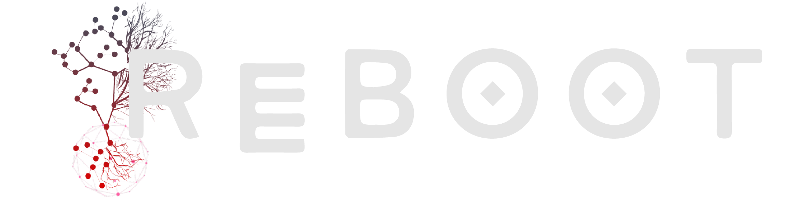

# Reboot

 

**REBOOT** is a "hands-off" **VR/PC** prototype for use in pain research and rehabilitation to help address financial barriers in the delivery of VR neurofeedback intervention. Check out the [**website**](https://nathacks.vercel.app/) @ [rebootgame.vercel.app](https://rebootgame.vercel.app/) for more info!

## ✨ About

This project represents the collaborative efforts of a small team, submitted for [NeurAlbertaTech’s 2021 inaugural natHACKS](https://nathacks.devpost.com/) - a 64-hour hackathon organized around neurotechnology. 

**REBOOT** is a "hands-off" **VR/PC** experience, immersing the player in an array of 3D-rendered environments and tasking them with the objective of levitating a rock with their minds. The more you concentrate, the more the rock responds (yes, like a Jedi 🐱‍👤). 

Designed as an open-source prototype for use in pain research and rehabilitation, this game is compatible with both Muse and OpenBCI technology to optimize accessibility and address some of the financial barriers in the delivery of VR neurofeedback intervention. We hope to expand upon these concepts and extend the project’s utility to broaden the scope of novel psychological research along both therapeutic and foundational dimensions, including investigations into the intersections of physical and mental pain perception. 

Play your brains out! 🎉

## 💻 Screenshots

## 🔨 Tools

### Software

* [Unity](https://unity.com/) - URP + WebGL
* [Blender](https://www.blender.org/)
* [TreeIt](https://www.evolved-software.com/treeit/treeit) - tree generator
* [Brainflow](https://brainflow.org/)
* [GitHub](https://www.github.com) - version control + project manager
* [Figma](https://www.figma.com/file/IcfrvkiN2HaKL51XlhzF6Y/natHACKS?node-id=0%3A1) - rapid UI prototyping
* React-Typescript - Website
* Adobe Illustrator - Vector assets

### Hardware

* Muse
* OpenBCI

## 🏃‍♀️ Running

Unity:

* Have Unity 2020.3 (LTS)

Front end:

* Node
* then do `npm install` followed by `npm start`

## 👨‍👧‍👧 Team

<!--- put your links here --->

* [Andrew Li](http://andrewli.site/) - Unity/Game dev + front end
* [Andrew Tischenko](https://github.com/antis0007) - Unity/Game dev 
* [Faiyaz](https://github.com/Faiyaz42) - Scene design, (Senior) Chad 
* [Manuel Illanes](https://github.com/rmib200) - ML, Unity/Game Dev
* [Teagan]() - Research, Design

## 📰 Notes

* Use your own branch and pull request to main
* Also use new scene in Unity and do prefabs 
* Abstract is the about section but you can view it in glorious LaTeX [here](https://github.com/Zeyu-Li/Reboot/blob/main/abstract/abstract.pdf)

[🔝 Back to Top](#top)

