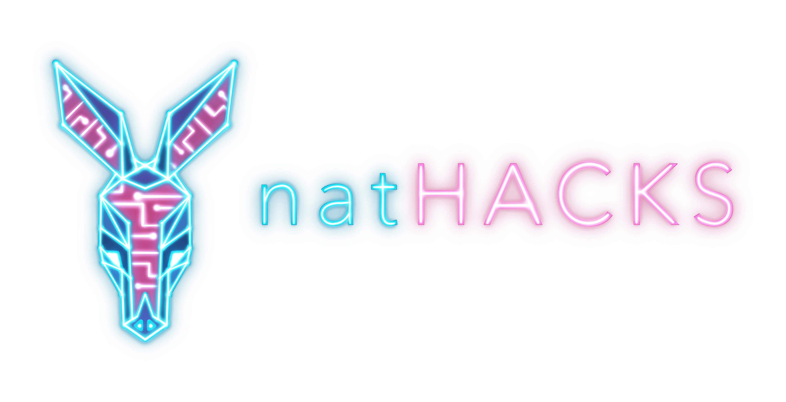

# natHACKS

 

Website is live @ [nathacks.vercel.app](https://nathacks.vercel.app/)

## ✨ About

A [natHACKS](https://nathacks.devpost.com/) project

## 🔨 Tools

### Software

* [Unity](https://unity.com/) - URP + WebGL
* [Blender](https://www.blender.org/)
* [TreeIt](https://www.evolved-software.com/treeit/treeit) - tree generator
* [Brainflow](https://brainflow.org/)
* [GitHub](https://www.github.com) - version control + project manager
* [Figma](https://www.figma.com/file/IcfrvkiN2HaKL51XlhzF6Y/natHACKS?node-id=0%3A1) - rapid UI prototyping
* React-Typescript - Website

### Hardware

* Muse
* OpenBCI

## 🏃‍♀️ Running

Unity:

* Have Unity 2020.3 (LTS)

Front end:

* Node
* then do `npm install` followed by `npm start`

## 👨‍👧‍👧 Team

<!--- put your links here --->

* [Andrew Li](http://andrewli.site/) - Unity/Game dev + front end
* [Andrew Tischenko]() - Unity/Game dev 
* [Faiyaz]() - Chad 
* [Manuel Illanes]() - ML
* [Teagan]() - Research

## 📰 Notes

* Use your own branch and pull request to main
* Also use new scene in Unity and do prefabs 